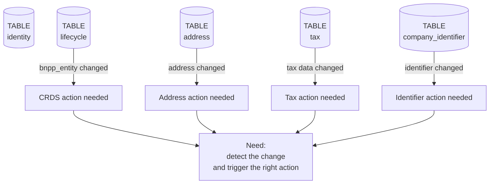
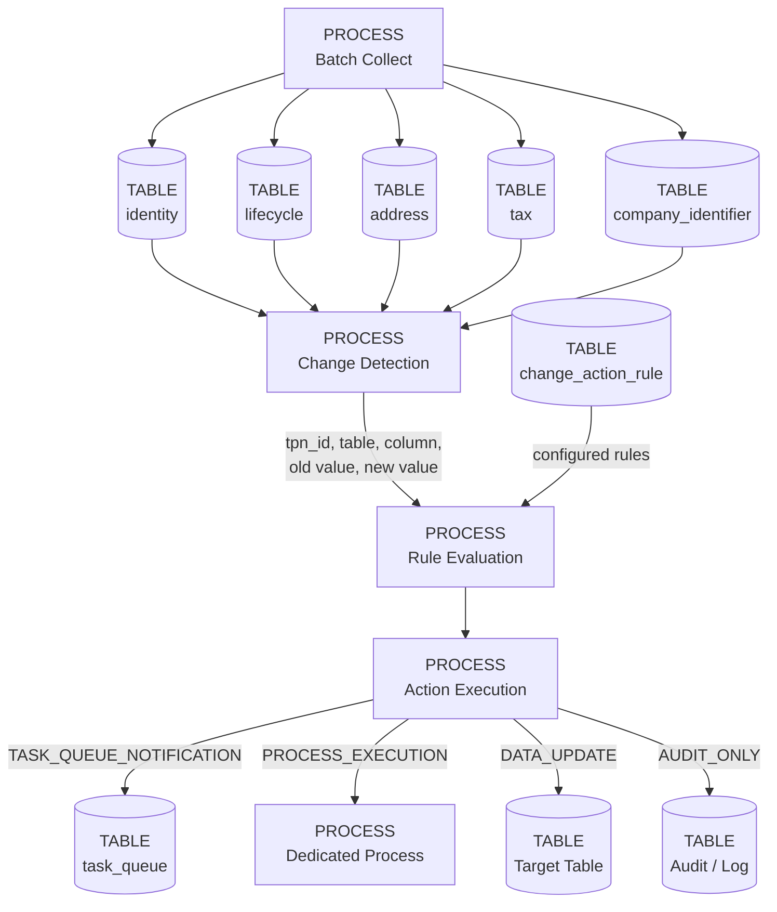
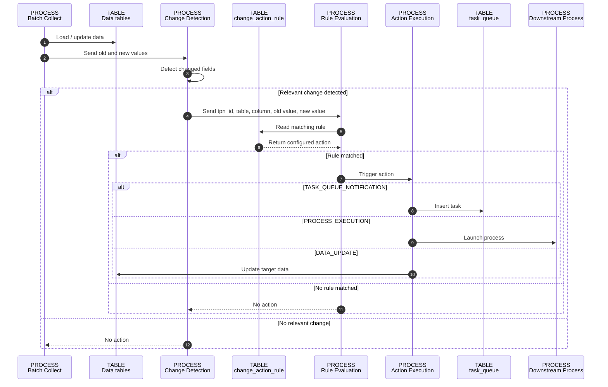
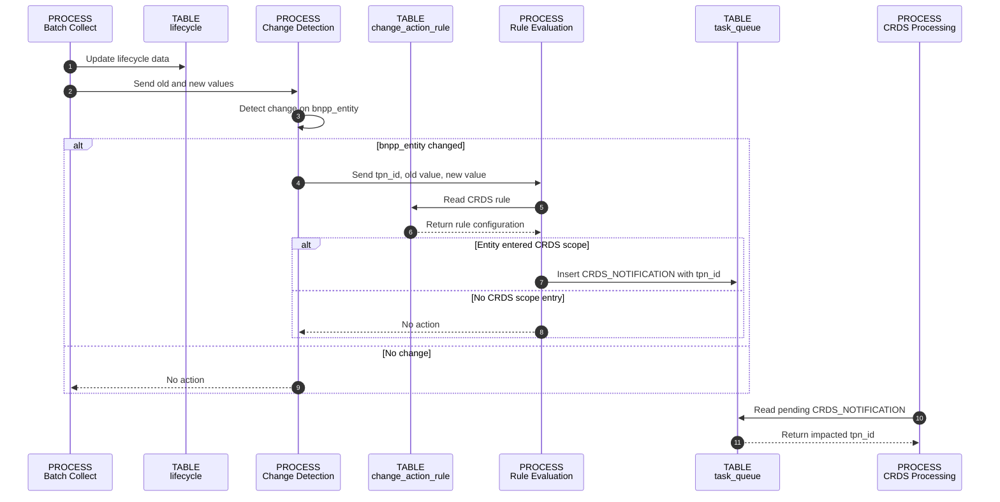

# Flexible Change-Based Action Triggering

## 1. Context

Today, some actions are already triggered through `task_queue`.

Example: `update_identification` does not replay the full matching.
It uses existing results from `matching` and replays only prioritization to update `legal_entity`.

New need: trigger actions when specific data changes are detected around `identity`.

Main related tables:

* `lifecycle`
* `address`
* `tax`
* `company_identifier`

Common key: `tpn_id`.

---

## 2. Need

Some data changes can have a business impact and must trigger a specific action.

First use case:

```text
lifecycle.bnpp_entity changes
old value = outside CRDS scope
new value = inside CRDS scope
→ trigger CRDS action
```

Expected action for this case:

```text
Insert CRDS_NOTIFICATION into task_queue with the impacted tpn_id.
```

But the need must stay generic.



---

## 3. Proposed Solution

Introduce a generic mechanism:

```text
Data change detected
→ rule evaluation
→ configured action triggered
```

The action can be:

* create a task in `task_queue`
* launch a process
* update a table
* replay prioritization
* write an audit/log event



---

## 4. Configuration Table

Proposed table:

```text
change_action_rule
```

| Column                | Description                     |
| --------------------- | ------------------------------- |
| `rule_id`             | Technical rule ID               |
| `rule_name`           | Functional rule name            |
| `source_table`        | Table to monitor                |
| `source_column`       | Column to monitor               |
| `old_value_condition` | Condition on old value          |
| `new_value_condition` | Condition on new value          |
| `action_type`         | Type of action                  |
| `action_name`         | Action name                     |
| `target_process`      | Process to launch, if needed    |
| `target_table`        | Table to update, if needed      |
| `is_enabled`          | Rule activation flag            |
| `priority`            | Priority if several rules match |
| `created_at`          | Creation timestamp              |
| `updated_at`          | Last update timestamp           |

---

## 5. Example Rules

| rule_name                 | source_table         | source_column      | condition                                     | action_type               | action_name                 |
| ------------------------- | -------------------- | ------------------ | --------------------------------------------- | ------------------------- | --------------------------- |
| Entity enters CRDS scope  | `lifecycle`          | `bnpp_entity`      | Old outside CRDS scope, new inside CRDS scope | `TASK_QUEUE_NOTIFICATION` | `CRDS_NOTIFICATION`         |
| Address changed           | `address`            | `address_value`    | Any change                                    | `PROCESS_EXECUTION`       | `ADDRESS_UPDATE_PROCESS`    |
| Tax changed               | `tax`                | `tax_value`        | Any change                                    | `PROCESS_EXECUTION`       | `TAX_PROCESSING`            |
| Identifier changed        | `company_identifier` | `identifier_value` | Any change                                    | `PROCESS_EXECUTION`       | `IDENTIFIER_RECONCILIATION` |
| Legal entity data changed | `legal_entity`       | selected fields    | Any change                                    | `PRIORITIZATION_REPLAY`   | `UPDATE_IDENTIFICATION`     |

---

## 6. How It Works

When data is updated:

```text
1. Compare old value and new value
2. Detect relevant changes
3. Read enabled rules from change_action_rule
4. Check rule conditions
5. Trigger configured action
```

For CRDS:

```text
source_table = lifecycle
source_column = bnpp_entity
old_value_condition = NOT_IN_CRDS_SCOPE
new_value_condition = IN_CRDS_SCOPE
action_type = TASK_QUEUE_NOTIFICATION
action_name = CRDS_NOTIFICATION
```

Task created in `task_queue`:

```text
task_name      = CRDS_NOTIFICATION
status         = PENDING
tpn_id         = impacted tpn_id
source_table   = lifecycle
source_column  = bnpp_entity
old_value      = previous bnpp_entity value
new_value      = new bnpp_entity value
event_type     = BNPP_ENTITY_ENTERED_CRDS_SCOPE
created_at     = current timestamp
```

---

## 7. Action Types

| action_type               | Meaning                         |
| ------------------------- | ------------------------------- |
| `TASK_QUEUE_NOTIFICATION` | Insert a task into `task_queue` |
| `PROCESS_EXECUTION`       | Launch a dedicated process      |
| `DATA_UPDATE`             | Update a target table           |
| `PRIORITIZATION_REPLAY`   | Replay prioritization logic     |
| `AUDIT_ONLY`              | Write audit/log only            |

---

## 8. Generic Sequence Diagram



---

## 9. CRDS Sequence Diagram



---

## 10. Key Points

* CRDS is the first use case.
* The mechanism is generic.
* New rules can be added by configuration.
* The action is not always a notification.
* `tpn_id` is the key used to link the event to the impacted entity.
* The same logic can be reused for `address`, `tax`, `company_identifier`, or other future changes.
